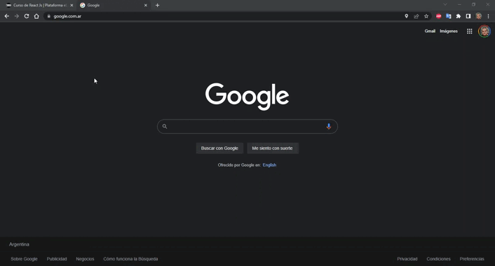

# React E-Commerce (Proyecto en progreso).

## Descripción.
El proyecto consta de un ecommerce realizado con React y Firebase como parte del proyecto final del curso de React de Coderhouse.

## Librerías Utilizadas.
- lord-icon-element
- lottie-web
- react
- react-dom
- react-router-dom
- react-scripts
- web-vitals

## DEMO

